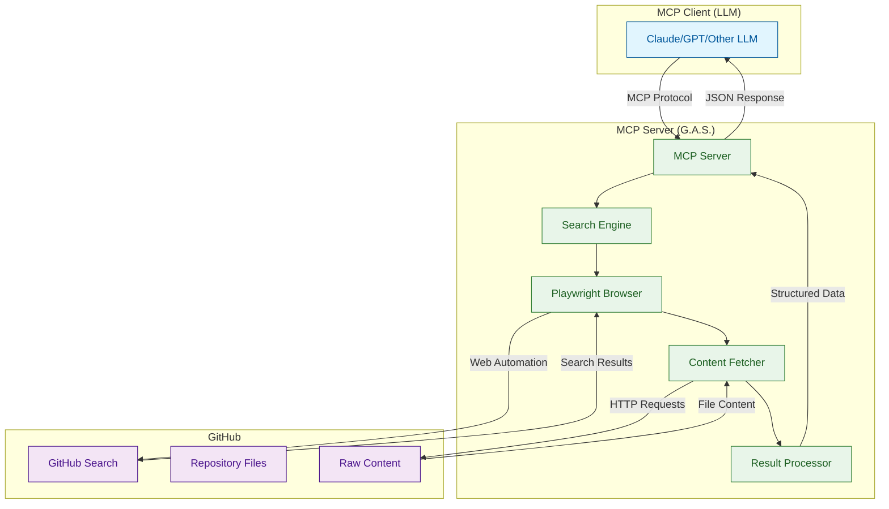
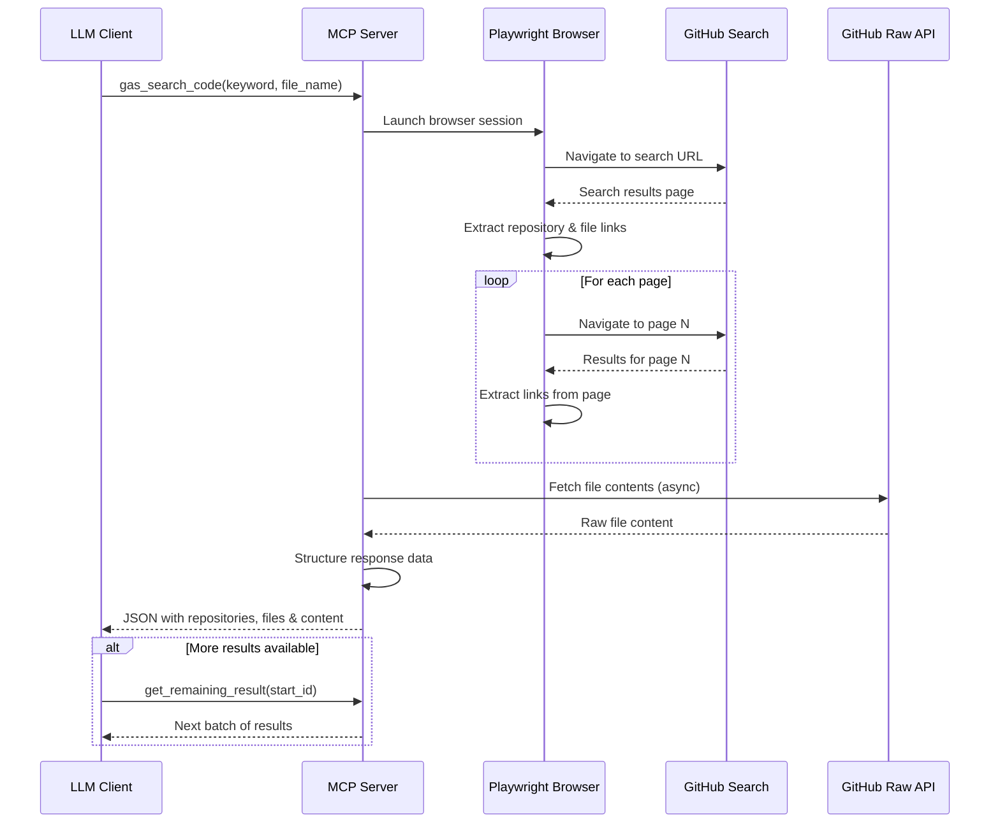
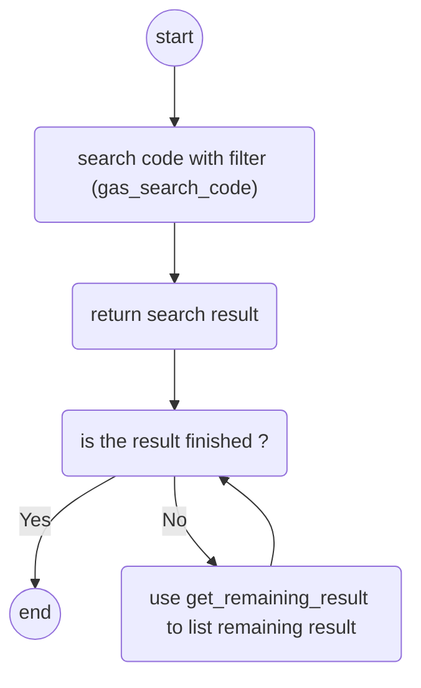

# MCP Server for GitHub Advanced Search (G.A.S.)

[](https://python.org)
[](https://opensource.org/licenses/MIT)
[](https://modelcontextprotocol.io/)

A powerful Model Context Protocol (MCP) server that enables Large Language Models to perform advanced GitHub code searches with intelligent filtering and content retrieval capabilities, optimized for DeepSeek integration.

## 🔍 Overview

The GitHub Advanced Search (G.A.S.) MCP server provides LLMs with sophisticated GitHub search capabilities that go beyond standard API limitations. Using web automation with Playwright, it enables deep code discovery, pattern analysis, and content retrieval across the entire GitHub ecosystem. This version includes enhanced support for DeepSeek models, providing tailored search results and structured JSON output.

## Demo

[youtube link to demo](https://youtu.be/kY7s_1GzZ3A)

### Key Features

- 🔍 **Advanced GitHub Search**: Search by keywords, file names, and complex filters
- 📁 **Content Retrieval**: Automatically fetch and return file contents
- 🤖 **LLM Integration**: Seamless integration with Claude, GPT, and other MCP-compatible LLMs
- 🔄 **Pagination Support**: Handle large result sets with intelligent pagination
- 🌐 **Web Automation**: Uses Playwright for robust GitHub interaction
- 📊 **Structured Results**: Returns organized JSON data with repository links, file links, and content
- ⚡ **High Performance**: Async operations with concurrent file downloads
- 🔐 **Authentication Support**: Works with GitHub login for private repositories
- 🤖 **DeepSeek Integration**: Optimized for use with DeepSeek models, providing tailored search results and structured JSON output

## 🏗️ Architecture



## 🔄 Search Workflow



## 🚀 Quick Start

### Prerequisites

- Python 3.10 or higher
- Node.js (for Playwright browser automation)
- GitHub account (recommended for optimal functionality)

### Installation

1. **Install the package:**

   ```bash
   pip install mcp-server-git-gas
   ```

2. **Install Playwright browsers:**

   ```bash
   playwright install chromium
   ```

3. **💀Not tested** **Configure your MCP client** (e.g. claude desktop):

   Add to your `claude_desktop_config.json`:

   ```json
   # not tested !!!
   {
     "mcpServers": {
       "github-advanced-search": {
         "command": "mcp-server-git-gas",
         "args": []
       }
     }
   }
   ```

### First Search

Once configured, you can start searching GitHub through your LLM:

```
Search GitHub for Python files containing "async def" functions
```

The LLM will automatically use the G.A.S. tools to perform the search and return structured results.

## 📦 Installation Options from Source

### step1 (clone source)

```bash
$ cd ~
$ git clone --depth=1 https://github.com/louiscklaw/mcp-github-advanced-search ~/mcp/mcp-git-gas
```

### step2 (install remaining dependencies, playwright)

```bash
# Install Playwright browsers
$ playwright install chrome
$ playwright install --deps
```

### step3 seed chrome user credentials

```bash
# this will create the user_data_dir for chromium
# go login google or any other service you want

$ cd ~/mcp/mcp-git-gas
$ ./seedChromeUserDataDir.sh
```

## ⚙️ Configuration

### VS Code with MCP Extension

```json
{
  "mcp": {
    "servers": {
      "git-gas": {
        "autoApprove": [
          "get_remaining_result",
          "gas_readme",
          "gas_search_code"
        ],
        "disabled": false,
        "timeout": 300,
        "type": "stdio",
        "command": "uv",
        "args": [
          "--directory",
          "<USER_HOME_DIR>/mcp/mcp-git-gas/src/mcp_server_git_gas",
          "run",
          "mcp-server-git-gas"
        ]
      }
    }
  }
}
```

## 🛠️ Available Tools

### `gas_entrypoint`

Initialize and get information about the GitHub Advanced Search server.

**Parameters:** None

**Returns:** Server information and usage instructions with workflow diagram.



### `gas_search_code`

Search GitHub repositories with advanced filters.

**Parameters:**

- `keyword` (string, optional): Search keyword (single word recommended)
- `file_name` (string, optional): Specific filename to search for (e.g., ".clinerules", "README.md")

**Returns:** Array of search results with:

```json
[
  {
    "REPOSITORY_LINK": "https://github.com/owner/repo",
    "FILE_LINK": "https://github.com/owner/repo/blob/main/file.py",
    "RAW_UESR_CONTENT_LINK": "https://raw.githubusercontent.com/owner/repo/main/file.py",
    "FILE_CONTENT": "actual file content..."
  }
]
```

### `get_remaining_result`

Retrieve additional results from a previous search (pagination).

**Parameters:**

- `start_id` (integer): Starting index for the next batch of results

**Returns:** Next batch of search results with the same structure as `gas_search_code`.

## 💡 Usage Examples

### step1

```
call `gas_entrypoint` to initialize yourself
```

### step2

```
Hi,

please use `gas_search_code` with below json

{
  "keyword": "mcp mermaid",
  "file_name": "README.md"
}

and understand the content returned, i will send you the task afterwards.

```

### step3

```
i am working on a python project,
please task a look to the source code of the project.

with the help from files in former results.
please help to and update the README file.

```

## 🔧 Configuration & Environment

### Browser Configuration

The server uses Playwright with persistent browser context for:

- Session management
- Authentication state preservation
- Improved performance

Browser data is stored in: `~/mcp/mcp-git-gas/_user_data_dir`

## 🏃‍♂️ Development

### Local Development Setup

```bash
# Clone the repository
git clone <repository-url>
cd mcp-server-git-gas

# Create virtual environment
python -m venv .venv
source .venv/bin/activate  # On Windows: .venv\Scripts/activate

# Install dependencies
pip install -e .

# Install development dependencies
pip install -e ".[dev]"

# Run tests
pytest
```

### Project Structure

```bash
src/mcp_server_git_gas/
├── __init__.py              # CLI entry point
├── server.py                # Main MCP server implementation
├── CONST.py                 # Configuration constants
├── fetch_data.py            # Async HTTP client
├── fetchFileContent.py      # File content retrieval
├── convertFileLinkToRaw...  # URL conversion utilities
├── url_util.py              # URL building helpers
└── git_dump_screen.py       # Debug utilities
```

### Key Components

- **MCP Server**: Implements the Model Context Protocol interface
- **Search Engine**: Handles GitHub search logic and pagination
- **Content Fetcher**: Retrieves file contents asynchronously
- **Browser Automation**: Playwright-based GitHub interaction

### Testing with MCP Inspector

```bash
# Test the server with MCP inspector
npx @modelcontextprotocol/inspector uvx mcp-server-git-gas
```

### Docker Development

```bash
# Build development image
docker build -t mcp/git-gas:dev .

# Run with volume mount for development
docker run --rm -i \
  -v $(pwd):/app \
  mcp/git-gas:dev
```

## 🔍 How It Works

1. **Search Initiation**: LLM calls `gas_search_code` with search parameters
2. **Query Building**: Server constructs GitHub search URL with filters
3. **Web Automation**: Playwright navigates GitHub search pages
4. **Result Extraction**: JavaScript execution extracts repository and file links
5. **Content Retrieval**: Parallel HTTP requests fetch file contents
6. **Response Formatting**: Results structured as JSON for LLM consumption

## 🐛 Troubleshooting

### Common Issues

1. **"Not logged in" errors**

   - Solution: run `seedChromeUserDataDir.sh` to start a browser and perform login

2. **No results found**

   - Check search `keywords` for typos
   - Try broader search criteria
   - Verify GitHub is accessible

3. **Browser launch failures**

   - Run: `playwright install chromium`
   - Check system requirements for Playwright

4. **Rate limiting**
   - GitHub may rate limit requests
   - The server includes delays and retry logic
   - Consider using authenticated sessions for higher limits

### Debug Mode

Debug screenshots are saved to: `~/mcp_github_advanced_search/debug.png`

## 📊 Performance

- **Search Speed**: ~2-5 seconds per search page
- **Concurrent Requests**: Up to 10 parallel file downloads
- **Result Limits**: 20 results per search (configurable)
- **Pagination**: Supports up to 2 pages (100+ results)

## 🚨 Important Notes

- **GitHub Authentication**: Login to GitHub in the browser for optimal results
- **Rate Limiting**: Respects GitHub's usage policies
- **Browser Requirements**: Requires Chromium browser (installed via Playwright)
- **Network Dependencies**: Requires internet connection for GitHub access

## 🤝 Contributing

We welcome contributions! Please see our [Contributing Guidelines](CONTRIBUTING.md) for details.

### Development Workflow

1. Fork the repository
2. Create a feature branch (`git checkout -b feature/amazing-feature`)
3. Make your changes
4. Add tests for new functionality
5. Run the test suite
6. Submit a pull request

## 📄 License

This project is licensed under the MIT License - see the [LICENSE](LICENSE) file for details.

## 🙏 Acknowledgments

- Built on the [Model Context Protocol](https://modelcontextprotocol.io/) by Anthropic
- Uses [Playwright](https://playwright.dev/) for browser automation
- Inspired by the need for advanced GitHub search capabilities in LLM workflows
- Thanks to the MCP community for feedback and contributions

## 🔗 Related Projects

- [Model Context Protocol](https://modelcontextprotocol.io/)
- [Anthropic MCP Servers](https://github.com/modelcontextprotocol/servers)
- [Playwright](https://playwright.dev/)
- [MCP Mermaid Image Gen](https://github.com/codingthefuturewithai/mcp_mermaid_image_gen)
- [MCP Governance SDK](https://github.com/ithena-one/mcp-governance-sdk)

## 📞 Support

- **Issues**: [GitHub Issues](https://github.com/your-repo/mcp-server-git-gas/issues)
- **Discussions**: [GitHub Discussions](https://github.com/your-repo/mcp-server-git-gas/discussions)
- **Documentation**: [Wiki](https://github.com/your-repo/mcp-server-git-gas/wiki)

---

**Note**: This server requires a GitHub account for optimal functionality. Some features may be limited when used without authentication.
