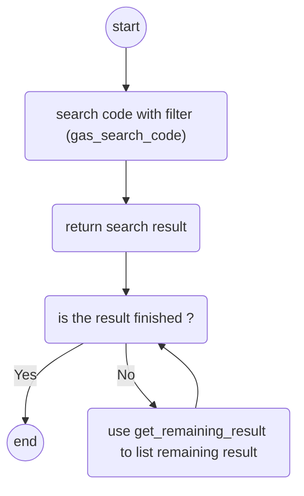

# gas_entrypoint

## introduction

This is a mcp that help user to search github search with advanced filter
the project name is `mcp_server_git_gas` a.k.a. `git_gas`
the available command are `gas_search_code` and `get_remaining_result`

The operation flow of this mcp is like below:



## example usage

### prompts / Example usage / Use case

```prompt

# step1: init gas
gas_entrypoint

# step2: feed model
gas_search_code
keyword: react
file_name: package.json

# step3: make your wish
please help to draft <blablabla>....
```

This mcp work best with:
    - `sequentialthinking`
    - `memory`
    - `structuredArgumentation`

when you found something you are not understand,

you can run `gas_entrypoint` again for better understanding.
