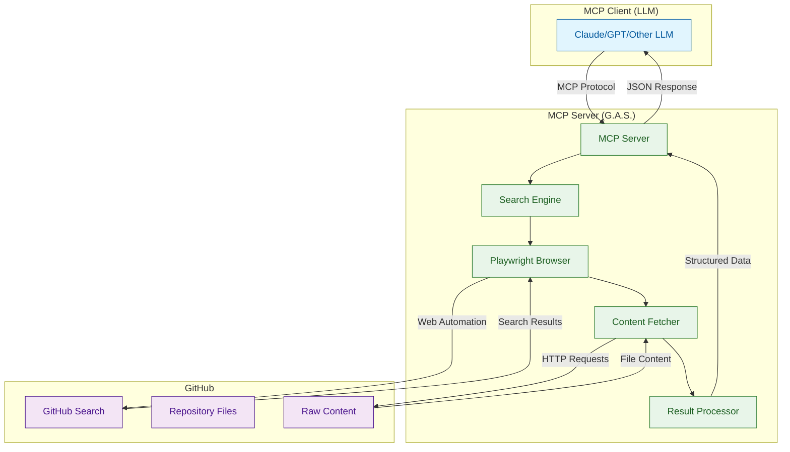
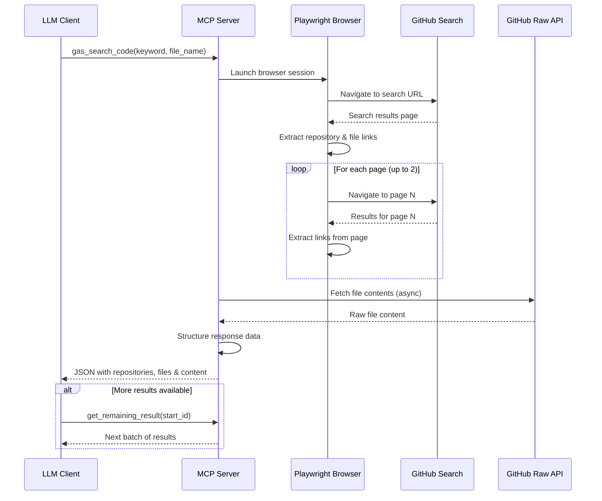
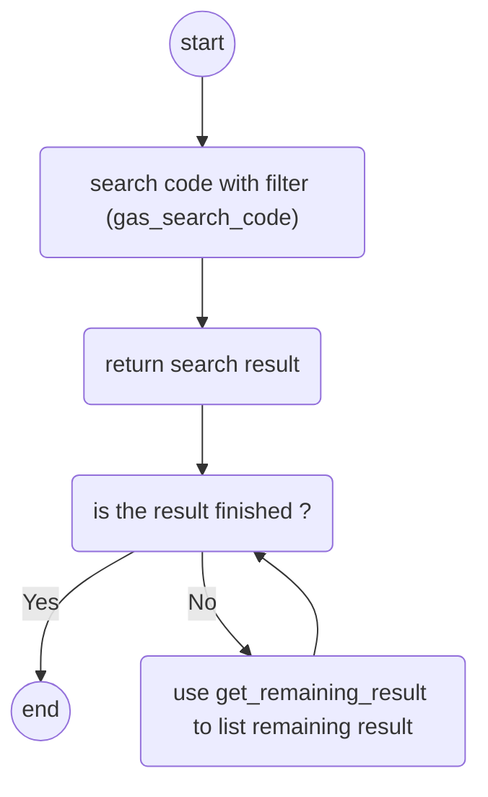

# MCP Server for GitHub Advanced Search (G.A.S.)

[](https://python.org)
[](https://opensource.org/licenses/MIT)
[](https://modelcontextprotocol.io/)
[](https://github.com/your-repo/mcp-server-git-gas)
[](https://github.com/your-repo/mcp-server-git-gas/actions)

A powerful Model Context Protocol (MCP) server that enables Large Language Models to perform advanced GitHub code searches with intelligent filtering and content retrieval capabilities.

## 🔍 Overview

The GitHub Advanced Search (G.A.S.) MCP server provides LLMs with sophisticated GitHub search capabilities that go beyond standard API limitations. Using web automation with Playwright, it enables deep code discovery, pattern analysis, and content retrieval across the entire GitHub ecosystem.

> **🎯 Perfect for**: Code discovery, pattern analysis, documentation research, and AI-assisted development workflows.

### Key Features

- 🔍 **Advanced GitHub Search**: Search by keywords, file names, and complex filters
- 📁 **Content Retrieval**: Automatically fetch and return file contents
- 🤖 **LLM Integration**: Seamless integration with Claude, GPT, and other MCP-compatible LLMs
- 🔄 **Pagination Support**: Handle large result sets with intelligent pagination
- 🌐 **Web Automation**: Uses Playwright for robust GitHub interaction
- 📊 **Structured Results**: Returns organized JSON data with repository links, file links, and content
- ⚡ **High Performance**: Async operations with concurrent file downloads
- 🔐 **Authentication Support**: Works with GitHub login for private repositories

## 🏗️ Architecture



## 🔄 Search Workflow



## 🚀 Quick Start

### Prerequisites

- Python 3.10 or higher
- Node.js (for Playwright browser automation)
- GitHub account (recommended for optimal functionality)

### Installation

1. **Install the package:**
   ```bash
   pip install mcp-server-git-gas
   ```

2. **Install Playwright browsers:**
   ```bash
   playwright install chromium
   ```

3. **Configure your MCP client** (e.g., Claude Desktop):

   Add to your `claude_desktop_config.json`:
   ```json
   {
     "mcpServers": {
       "github-advanced-search": {
         "command": "mcp-server-git-gas",
         "args": []
       }
     }
   }
   ```

### First Search

Once configured, you can start searching GitHub through your LLM:

```
Search GitHub for Python files containing "async def" functions
```

The LLM will automatically use the G.A.S. tools to perform the search and return structured results.

## 📦 Installation Options

### Using uv (Recommended)

```bash
# Install and run directly with uvx
uvx mcp-server-git-gas
```

### Using pip

```bash
# Install the package
pip install mcp-server-git-gas

# Run the server
python -m mcp_server_git_gas
```

### Using Docker

```bash
# Build the Docker image
docker build -t mcp/git-gas .

# Run the container
docker run --rm -i mcp/git-gas
```

### Browser Setup

```bash
# Install Playwright browsers
playwright install chrome
playwright install --deps
```

## ⚙️ Configuration

### Claude Desktop

Add to your `claude_desktop_config.json`:

```json
{
  "mcpServers": {
    "github-search": {
      "command": "uvx",
      "args": ["mcp-server-git-gas"]
    }
  }
}
```

### VS Code with MCP Extension

Add to your VS Code settings or `.vscode/mcp.json`:

```json
{
  "mcp": {
    "servers": {
      "github-search": {
        "command": "uvx",
        "args": ["mcp-server-git-gas"]
      }
    }
  }
}
```

### Cursor IDE

Add to your Cursor MCP configuration:

```json
{
  "mcpServers": {
    "github-search": {
      "command": "python",
      "args": ["-m", "mcp_server_git_gas"]
    }
  }
}
```

### Other MCP Clients

For other MCP-compatible clients, use the standard MCP server configuration pattern:

```json
{
  "servers": {
    "github-search": {
      "command": "mcp-server-git-gas",
      "args": [],
      "env": {}
    }
  }
}
```

## 🛠️ Available Tools

### `gas_readme`

Initialize and get information about the GitHub Advanced Search server.

**Parameters:** None

**Returns:** Server information and usage instructions with workflow diagram.



### `gas_search_code`

Search GitHub repositories with advanced filters.

**Parameters:**
- `keyword` (string, optional): Search keyword (single word recommended)
- `file_name` (string, optional): Specific filename to search for (e.g., ".clinerules", "README.md")

**Returns:** Array of search results with:
```json
[
  {
    "REPOSITORY_LINK": "https://github.com/owner/repo",
    "FILE_LINK": "https://github.com/owner/repo/blob/main/file.py",
    "RAW_UESR_CONTENT_LINK": "https://raw.githubusercontent.com/owner/repo/main/file.py",
    "FILE_CONTENT": "actual file content..."
  }
]
```

**Search Capabilities:**
- **Keyword Search**: Find specific terms, functions, or patterns
- **File Type Filtering**: Target specific file extensions or names
- **Content Analysis**: Retrieve full file contents for analysis
- **Repository Discovery**: Find relevant repositories and projects

### `get_remaining_result`

Retrieve additional results from a previous search (pagination).

**Parameters:**
- `start_id` (integer): Starting index for the next batch of results

**Returns:** Next batch of search results with the same structure as `gas_search_code`.

## 💡 Usage Examples

### Search for React Hooks
```
Find React components using useState hook
```
*The LLM will search for "useState" in JavaScript/TypeScript files*

### Find Configuration Files
```
Show me examples of .clinerules files
```
*The LLM will search for files named ".clinerules"*

### Discover API Patterns
```
Find Python files with async database operations
```
*The LLM will search for "async" keyword in Python files*

### Advanced Search Patterns

#### MCP Server Discovery
```
Find MCP server implementations with Mermaid diagrams
```
*Searches for "mcp" keyword in README.md files*

#### Framework Analysis
```
Show me FastAPI authentication implementations
```
*Searches for "FastAPI" and "auth" patterns*

#### Documentation Research
```
Find comprehensive README files for Python MCP projects
```
*Targets README.md files in Python projects*

### Basic Search Examples

```bash
# Search for MCP-related README files
{
  "tool": "gas_search_code",
  "parameters": {
    "keyword": "mcp",
    "file_name": "README.md"
  }
}
```

```bash
# Find all .clinerules files
{
  "tool": "gas_search_code",
  "parameters": {
    "file_name": ".clinerules"
  }
}
```

```bash
# Search for specific functions or patterns
{
  "tool": "gas_search_code",
  "parameters": {
    "keyword": "async"
  }
}
```

## 🔧 Configuration & Environment

### Environment Variables

- `HOME`: User home directory (used for browser data storage)
- `MCP_HOME_DIR`: Custom directory for MCP data (optional)

### Browser Configuration

The server uses Playwright with persistent browser context for:
- Session management
- Authentication state preservation
- Improved performance

Browser data is stored in: `~/mcp_github_advanced_search/_user_data_dir`

## 🏃‍♂️ Development

### Local Development Setup

```bash
# Clone the repository
git clone <repository-url>
cd mcp-server-git-gas

# Create virtual environment
python -m venv .venv
source .venv/bin/activate  # On Windows: .venv\Scripts\activate

# Install dependencies
pip install -e .

# Install development dependencies
pip install -e ".[dev]"

# Run tests
pytest
```

### Project Structure

```
src/mcp_server_git_gas/
├── __init__.py              # CLI entry point and main function
├── server.py                # Main MCP server implementation
├── CONST.py                 # Configuration constants
├── fetch_data.py            # Async HTTP client for content retrieval
├── fetchFileContent.py      # File content retrieval utilities
├── convertFileLinkToRaw...  # URL conversion utilities
├── url_util.py              # URL building helpers
├── git_dump_screen.py       # Debug utilities
└── helloworld.py            # Example/test functions
```

### Key Components

- **MCP Server**: Implements the Model Context Protocol interface
- **Search Engine**: Handles GitHub search logic and pagination
- **Content Fetcher**: Retrieves file contents asynchronously
- **Browser Automation**: Playwright-based GitHub interaction
- **URL Utilities**: Convert GitHub URLs to raw content links

### Testing with MCP Inspector

```bash
# Test the server with MCP inspector
npx @modelcontextprotocol/inspector uvx mcp-server-git-gas
```

### Docker Development

```bash
# Build development image
docker build -t mcp/git-gas:dev .

# Run with volume mount for development
docker run --rm -i \
  -v $(pwd):/app \
  mcp/git-gas:dev
```

## 🔍 How It Works

1. **Search Initiation**: LLM calls `gas_search_code` with search parameters
2. **Query Building**: Server constructs GitHub search URL with filters
3. **Web Automation**: Playwright navigates GitHub search pages
4. **Result Extraction**: JavaScript execution extracts repository and file links
5. **Content Retrieval**: Parallel HTTP requests fetch file contents
6. **Response Formatting**: Results structured as JSON for LLM consumption

### Technical Implementation Details

- **Concurrent Processing**: Up to 10 parallel file downloads
- **Smart Pagination**: Automatically handles GitHub's pagination limits
- **Error Handling**: Robust error handling for network issues and rate limits
- **Authentication**: Supports GitHub login for private repository access
- **Caching**: Browser session persistence for improved performance

## 🐛 Troubleshooting

### Common Issues

1. **"Not logged in" errors**
   - Solution: Open browser and log into GitHub manually
   - The server uses persistent browser context to maintain session

2. **No results found**
   - Check search terms for typos
   - Try broader search criteria
   - Verify GitHub is accessible

3. **Browser launch failures**
   - Run: `playwright install chromium`
   - Check system requirements for Playwright

4. **Rate limiting**
   - GitHub may rate limit requests
   - The server includes delays and retry logic
   - Consider using authenticated sessions for higher limits

5. **File content not retrieved**
   - Check if repositories are public
   - Verify network connectivity
   - Ensure GitHub raw content URLs are accessible

### Debug Mode

Enable verbose logging:
```bash
mcp-server-git-gas -v
```

Debug screenshots are saved to: `~/mcp_github_advanced_search/debug.png`

### Log Files

```bash
# Run with verbose logging
python -m mcp_server_git_gas -v

# Run with debug logging
python -m mcp_server_git_gas -vv
```

## 📊 Performance

- **Search Speed**: ~2-5 seconds per search page
- **Concurrent Requests**: Up to 10 parallel file downloads
- **Result Limits**: 20 results per search (configurable)
- **Pagination**: Supports up to 2 pages (100+ results)
- **Memory Usage**: Efficient memory management with streaming responses
- **Network Optimization**: Intelligent request batching and retry logic

## 🚨 Important Notes

- **GitHub Authentication**: Login to GitHub in the browser for optimal results
- **Rate Limiting**: Respects GitHub's usage policies and implements backoff strategies
- **Browser Requirements**: Requires Chromium browser (installed via Playwright)
- **Network Dependencies**: Requires internet connection for GitHub access
- **Privacy**: No data is stored permanently; all searches are ephemeral

## 🔒 Security Considerations

- **Browser Isolation**: Uses isolated browser contexts for security
- **No Credential Storage**: Does not store GitHub credentials
- **Rate Limit Compliance**: Respects GitHub's terms of service
- **Content Filtering**: Only retrieves publicly accessible content by default

## 🤝 Contributing

We welcome contributions! Please see our [Contributing Guidelines](CONTRIBUTING.md) for details.

### Development Workflow

1. Fork the repository
2. Create a feature branch (`git checkout -b feature/amazing-feature`)
3. Make your changes
4. Add tests for new functionality
5. Run the test suite
6. Submit a pull request

### Code Style

- Follow PEP 8 for Python code
- Use type hints where appropriate
- Add docstrings for public functions
- Include tests for new features

## 📄 License

This project is licensed under the MIT License - see the [LICENSE](LICENSE) file for details.

## 🙏 Acknowledgments

- Built on the [Model Context Protocol](https://modelcontextprotocol.io/) by Anthropic
- Uses [Playwright](https://playwright.dev/) for browser automation
- Inspired by the need for advanced GitHub search capabilities in LLM workflows
- Thanks to the MCP community for feedback and contributions

## 🔗 Related Projects

- [Model Context Protocol](https://modelcontextprotocol.io/)
- [Anthropic MCP Servers](https://github.com/modelcontextprotocol/servers)
- [Playwright](https://playwright.dev/)
- [MCP Mermaid Image Gen](https://github.com/codingthefuturewithai/mcp_mermaid_image_gen)
- [MCP Governance SDK](https://github.com/ithena-one/mcp-governance-sdk)

## 📞 Support

- **Issues**: [GitHub Issues](https://github.com/your-repo/mcp-server-git-gas/issues)
- **Discussions**: [GitHub Discussions](https://github.com/your-repo/mcp-server-git-gas/discussions)
- **Documentation**: [Wiki](https://github.com/your-repo/mcp-server-git-gas/wiki)
- **MCP Community**: [Model Context Protocol Discord](https://discord.gg/modelcontextprotocol)

## 🗺️ Roadmap

- [ ] **Enhanced Search Filters**: Add support for language, date, and size filters
- [ ] **Batch Operations**: Support for multiple simultaneous searches
- [ ] **Result Caching**: Implement intelligent caching for frequently accessed content
- [ ] **API Integration**: Direct GitHub API integration for improved performance
- [ ] **Custom Extractors**: Pluggable content extractors for different file types
- [ ] **Analytics**: Search analytics and usage metrics

---

**Note**: This server requires a GitHub account for optimal functionality. Some features may be limited when used without authentication.