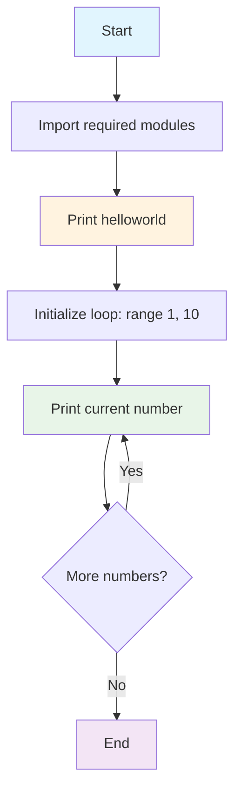

# HelloWorld Python Project

[](https://www.python.org/downloads/)
[](https://opensource.org/licenses/MIT)
[](https://www.python.org/dev/peps/pep-0008/)

A simple Python project demonstrating basic programming concepts including console output and loop iteration. Perfect for beginners learning Python fundamentals.

## Table of Contents

- [Description](#description)
- [Prerequisites](#prerequisites)
- [Installation](#installation)
- [Usage](#usage)
- [Project Structure](#project-structure)
- [Features](#features)
- [Development](#development)
- [Contributing](#contributing)
- [License](#license)

## Description

This project serves as a foundational example for Python programming, showcasing:

- Basic console output with `print()` statements
- Loop iteration using `range()` and `for` loops
- Simple program structure and execution flow

The application prints "helloworld" followed by numbers 1 through 9, demonstrating fundamental Python concepts in a clear, educational manner.

## Prerequisites

Before running this project, ensure you have:

- **Python 3.8 or higher** installed on your system
- Basic familiarity with command line/terminal operations

### Check Your Python Version

```bash
python --version
# or
python3 --version
```

You should see output like: `Python 3.8.x` or higher.

## Installation

### 1. Clone the Repository

```bash
git clone <your-repository-url>
cd HelloWorldProject
```

### 2. Set Up Virtual Environment (Recommended)

```bash
# Create virtual environment
python -m venv venv

# Activate virtual environment
# On Windows:
venv\Scripts\activate
# On macOS/Linux:
source venv/bin/activate
```

### 3. Verify Installation

```bash
# Check if Python is accessible
python --version
```

## Usage

### Running the Application

Navigate to the project directory and execute:

```bash
python src/main.py
```

### Expected Output

```
helloworld
1
2
3
4
5
6
7
8
9
```

### Alternative Execution Methods

```bash
# From project root
python -m src.main

# Direct execution (if main.py has shebang)
./src/main.py
```

## Project Structure

```
HelloWorldProject/
|
+-- src/
|   +-- main.py          # Main application file
+-- readme.md            # Project documentation
+-- venv/               # Virtual environment (created after setup)
```

### File Descriptions

- **`src/main.py`**: Contains the main application logic with print statements and loop iteration
- **`readme.md`**: Comprehensive project documentation and usage instructions
- **`venv/`**: Python virtual environment directory (created during setup)

## Project Flow

Here's a mermaid flowchart illustrating the execution flow of the program:



## Features

- **Simple Console Output**: Demonstrates basic `print()` functionality
- **Loop Iteration**: Shows `for` loop usage with `range()` function
- **Clean Code Structure**: Follows Python best practices and PEP8 guidelines
- **Educational Value**: Perfect for Python beginners and educational purposes
- **Cross-Platform**: Runs on Windows, macOS, and Linux

## Development

### Code Style

This project follows [PEP8](https://www.python.org/dev/peps/pep-0008/) Python style guidelines.

### Adding Features

To extend this project:

1. **Add new functionality** to `src/main.py`
2. **Follow Python naming conventions**
3. **Add comments** for complex logic
4. **Update this README** with new features

### Example Extensions

```python
# Add user input
name = input("Enter your name: ")
print(f"Hello, {name}!")

# Add functions
def greet_user():
    print("helloworld")

# Add error handling
try:
    # Your code here
    pass
except Exception as e:
    print(f"An error occurred: {e}")
```

## Testing

### Running Tests

Currently, this project doesn't include formal tests, but you can verify functionality by:

```bash
# Run the main script and verify output
python src/main.py

# Expected output should match the pattern shown in Usage section
```

### Adding Tests

To add unit tests, create a `tests/` directory:

```bash
mkdir tests
touch tests/__init__.py
touch tests/test_main.py
```

Example test structure:

```python
# tests/test_main.py
import unittest
import sys
import os

# Add src to path for imports
sys.path.insert(0, os.path.join(os.path.dirname(__file__), '..', 'src'))

class TestMain(unittest.TestCase):
    def test_output(self):
        # Add your tests here
        pass

if __name__ == '__main__':
    unittest.main()
```

## Contributing

We welcome contributions! To contribute:

1. **Fork** the repository
2. **Create** a feature branch (`git checkout -b feature/amazing-feature`)
3. **Commit** your changes (`git commit -m 'Add some amazing feature'`)
4. **Push** to the branch (`git push origin feature/amazing-feature`)
5. **Open** a Pull Request

### Contribution Guidelines

- Follow PEP8 coding standards
- Add comments for new functionality
- Update documentation as needed
- Test your changes before submitting

## Troubleshooting

### Common Issues

**Issue**: `python: command not found`

- **Solution**: Ensure Python is installed and added to your system PATH

**Issue**: `ModuleNotFoundError`

- **Solution**: Make sure you're running the script from the correct directory

**Issue**: Permission denied on Linux/macOS

- **Solution**: Make the script executable: `chmod +x src/main.py`

### Getting Help

If you encounter issues:

1. Check the [Prerequisites](#prerequisites) section
2. Verify your Python installation
3. Ensure you're in the correct directory
4. Check file permissions

## License

This project is licensed under the MIT License - see the [LICENSE](LICENSE) file for details.

## Acknowledgments

- Inspired by classic "Hello World" programming examples
- Built following Python community best practices
- Educational resource for Python beginners

---

**Happy Coding!** 🐍✨
